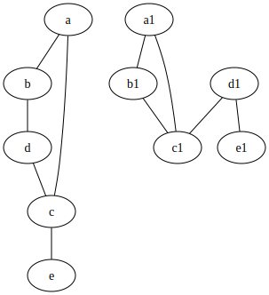
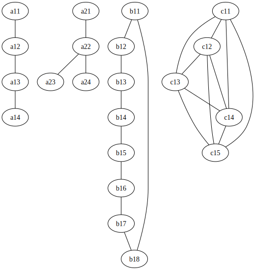

# 2.1 Problems and Definitions

Graphs are a mathematical object made of 2 sets. One set of vertices $V$ and a
set of edges $E$ that are pairs of vertices from $V$. 2 vertices connected by
one edge is adjacent. $V$ cannot be empty. $E$ can also be described as a set of
2 element subsets of $V$

An adjacency list is a list of each vertex and the other vertices that it is
connected to.

|vertex|adjacent to|
|---|---|
|a|b,c|
|b|a,d|
|c|a,d|
|d|b,c|

An adjacency matrix encodes which vertices are adjacent by placing ones in the
squares where the vertex the row corresponds to is adjacent to the vertex the
column corresponds to.

$$
\begin{pmatrix}
0 & 1 & 1 & 0 \\
1 & 0 & 0 & 1 \\
1 & 0 & 0 & 1 \\
0 & 1 & 1 & 0 \\
\end{pmatrix}
$$

A graph is connected if every vertex is connected to every other vertex either
directly or through other vertices. A graph contains a cycle if a vertex
connects back to itself through other vertices.

Graphs are equal if the vertex sets are the same and the edge sets are the same.
Graphs are isomorphic if they are basically the same, but the nodes are labeled
differently. An isomorphism can be defined precisely if there is a function $f:
V_1 -> V_2$ that maps a vertex in the first graph to a vertex in the second
graph so that if and only if ${a, b}$ is an edge in $G_1$, ${f(a), f(b)}$ is an
edge in $G_2$. This function in a bijection because every vertex in $G_1$ maps
to exactly one unique vertex in $G_2$.

When a graph has no labels or is a special known type, that is an isomorphism
class and refers to all graphs that are isomorphic to it.

A graph, $G' = (V', E')$ is a subgraph of $G = (V, E)$ is written as $G'
\subseteq G$, provided $V' \subseteq V$ and $E' \subseteq E$.

A graph, $G' = (V', E')$ is an induced subgraph of $G = (V, E)$ provided $V'
\subseteq V$ and every edge in $E$ whose vertices are in $V'$ is in $E'$. This
means that every single possible edge is part of the subgraph given the set of
vertices.

Every induced subgraph is a normal subgraph but no every normal subgraph is an
induced subgraph.

Simple graphs are graphs where no vertex is connected to itself and no edge is
repeated. These are often just called graphs because the definition of an edge
as a subset of vertices doesn't allow for self-connected vertices and a set
cannot contain the same item twice.

A multigraph allows edges to be repeated. The set of edges is a multiset because
it can include a single element more than once.

A graph is complete if every pair of vertices is directly connected with an
edge. There is only one isomorphism class for the complete graph for a given
amount of vertices, and it is labeled $K_n$.

The degree of a vertex is the number of edges connected to it. Each vertex in
$K_n$ has a degree of (n-1). The number of edges a graph has is the sum of all
the degrees divided by 2 because every edge connects 2 vertices (This is called
the Handshake Lemma). For $K_n$ there are $\frac{n(n-1)}{2}$ edges. This means
the sum of all the degrees must be even because a graph cannot have half an
edge. This can also be written as the number of vertices with odd degree must be
even. The degree sequence of a graph is the list of every degree in
non-increasing (decreasing) order.

A graph is bipartite if it can be divided into two sets where no vertices in the
sets are adjactent to other vertices in that set. If each vertex in one set is
adjacent to all the vertices in the other set, the graph is a complete bipartite
graph.

## Named Graphs

$K_n$ - the complete graph
$K_m,n$ - the complete bipartite graph
$C_n$ - A cycle with $n$ vertices
$P_n$ - a path with $n$ vertices

## Vocab

|Word|Definition|
|---|---|
|graph|a set of vertices and a set of pairs of vertices called edges|
|adjactent|a pair of vertices that are connected by an edge|
|bipartite graph|a graph that is divisible into 2 sets which aren't interconnected|
|complete bipartite graph| a bipartite graph where each vertex in a set is connected to all the vertices in the other set|
|complete graph|every pair of vertices is adjacent|
|connected graph|every vertex is reachable by every other vertex|
|chromatic number|the minimum number of colors to color each vertex without putting the same color next to another|
|cycle|a path that starts and ends at the same vertex, without repeating|
|degree of a vertex|the number of edges connected to it|
|euler trail|a path that hits every edge exactly once|
|euler circuit|an euler trail that starts and ends at the same vertex|
|multigraph|a graph where edges can be repeated|
|path|a list of vertices where each one is connected to the next that doesn't repeat vertices or edges except possibly the first and last|
|planar|a graph that can be drawn in 2d without any edges overlapping|
|subgraph|a graph where are all the vertices and edges are subsets of the super graph|
|tree|a connected graph with no cycles|
|vertex coloring|giving a color to each vertex (proper if no colors are adjacent)|
|walk|a sequence of vertices where each vertex is adjacent to the next|
|trail|a sequence where no edge is repeated|

# Additional Exercises\

1. 45 handshakes. The people are vertices and the handshakes are edges
2. Everyone can be friends with exactly two people but not exactly 3
3. It is possible for 2 different graphs to have the same number of vertices and
   edges. It is also possible to have the same degrees but not be isomorphic.

4. They are not equal but they are isomorphic

$$
f = \begin{pmatrix}
a & b & c & d & e \\
d & c & e & b & a
\end{pmatrix}
$$

5. $f$ is not an isomorphism

$$
g = \begin{pmatrix}
a & b & c & d & e & f & g \\
v_4 & v_5 & v_6 & v_1 & v_7 & v_3 & v_2
\end{pmatrix}
$$

No because there is no vertex with degree 5 like $v_5$ or $b$

6. 45, 25, 9
7. The first is because the vertices on the sides aren't adjacent and the
   vertices in the center aren't adjacent. The second is bipartite because every
   other vertex is part of the first group and the rest are in the second group.
   The third isn't because there is an odd number of vertices so there will be
   one left over that is connected to both groups if you make every other vertex
   the first group. The last is because the vertex in the middle is one group
   and the vertices on the outside are the other.
8. Every graph $C_2k$ is bipartite
9.

There is no way to make more than one graph that fulfills c because it is a
complete graph. There is no way to make more than one graph that fulfills b because making a
unique graph would require moving a node so that one node has a higher degree
than 2. It is not possible to make any graph that matches d because it required
a graph with 7.5 edges.
